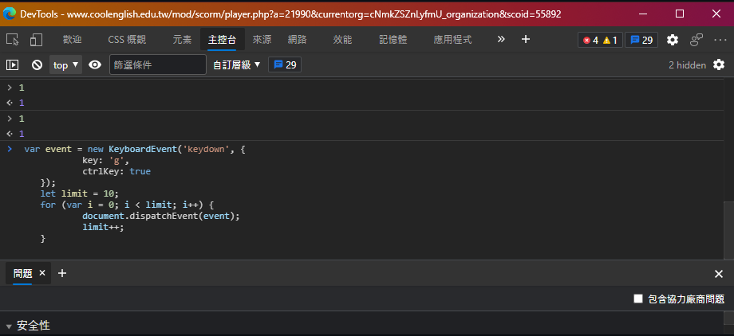

# Popcat-JS-support
## 重要資訊  
在執行的過程中，可能會跳出無回應的提示框，不必理會，  
可以放這在睡覺時弄，邊睡覺邊為國爭光  

## 所有程式片段
https://github.com/banahaker/PopcatJSsupport/blob/main/popcat.js

## 舉例片段
```javascript
    var event = new KeyboardEvent('keydown', {  
            key: 'g',  
            ctrlKey: true  
    });  
    let limit = 10;  
    for (var i = 0; i < limit; i++) {  
            document.dispatchEvent(event);  
            limit++;  
    }  
```
這樣整段就可以用了  
## 使用方法 
打開DevTool(開發者工具)(開啟方法: 按 <kbd>F12</kbd> 或右鍵檢查)  
並切換到console(控制或主控台)面板  
接著貼上複製好的程式碼  
按下 <kbd>Enter</kbd> 鍵就開始執行囉  


# Taiwan NO.1
Taiwan NO.1
Taiwan NO.1  
Taiwan NO.1
Taiwan NO.1  
Taiwan NO.1
Taiwan NO.1  
Taiwan NO.1
Taiwan NO.1  
